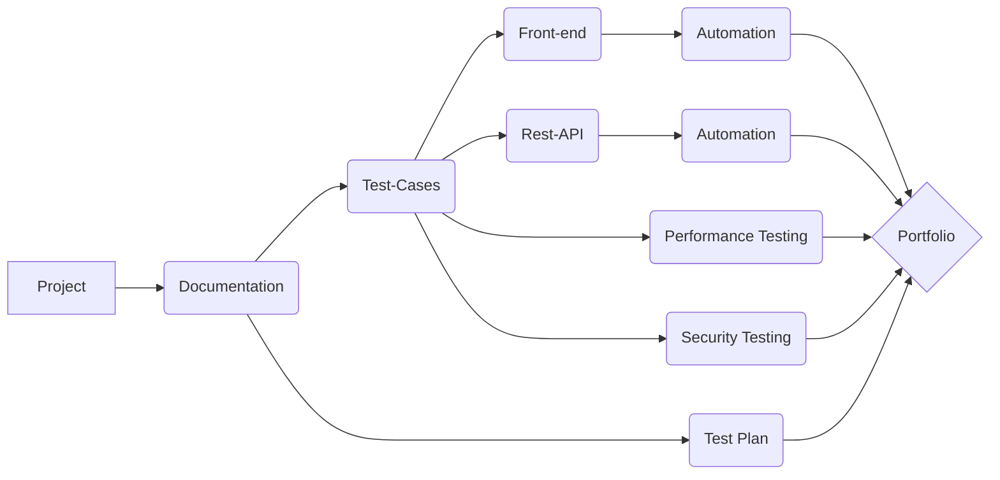

"Portfolio_Project" for _California Marketing Group_


```diff
#1589F0> Front-end - **Python** and **Selenium Web Driver**

+> Rest-API - **Java-Script** and **Postman**
-  `#1589F0`
```
-  `#1589F0`
