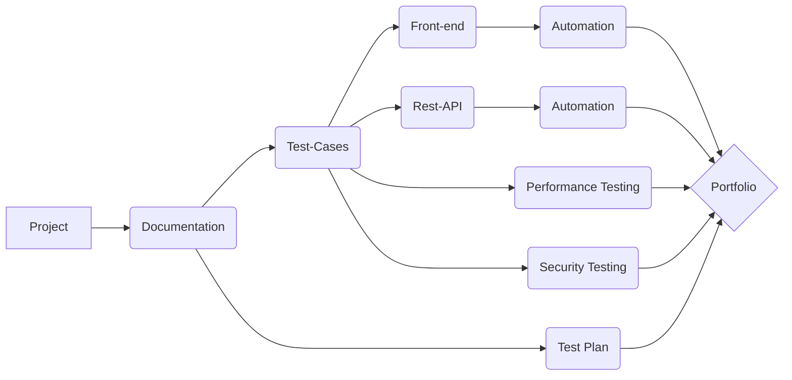

"Portfolio_Project" for _California Marketing Group_

$${\color{lightblue}Front-End\space **Python**\space and \space **Selenium\space Web\space Driver**\space  }$$

$${\color{lightgreen} Rest-API \space Java-Script \space Postman }$$
