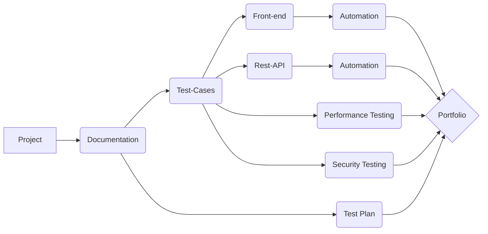

"Portfolio_Project" for _California Marketing Group_

$${\color{lightblue}FRONT-END\space **PYTHON**\space and \space **SELENIUM \space WEB\space DRIVER**\space  }$$

$${\color{lightgreen} REST-API \space JAVA-SCRIPT \space POSTMAN }$$

# Languages and Tools 

### Connect with me : 

[Allure Report 1](https://github.com/N-Uladzislau/Portfolio_Project/blob/main/Allure%20Reports/Allure_report.png)

[Allure Report 2](https://github.com/N-Uladzislau/Portfolio_Project/blob/main/Allure%20Reports/allure_report_1.png)

[HTML Report ](https://github.com/N-Uladzislau/Portfolio_Project/blob/main/HtmlReports/TestResults___main__.Chrome_CA_Marketing_2022-10-07_18-05-02.html)

