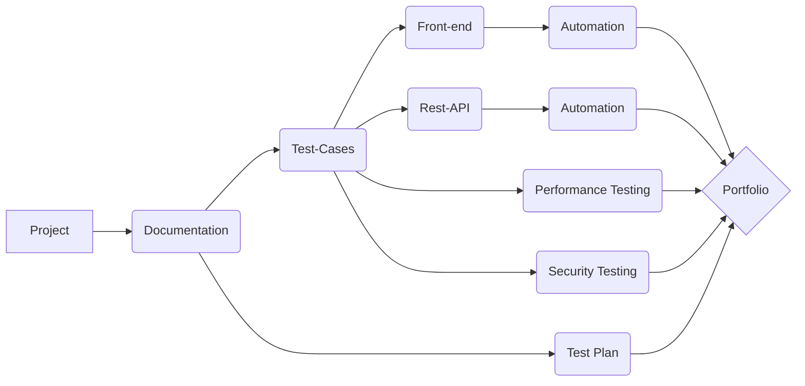

"Portfolio_Project" for _California Marketing Group_

$${\color{lightblue}FRONT-END\space **PYTHON**\space and \space **SELENIUM\space WEB\space DRIVER**\space  }$$

$${\color{lightgreen} REST-API \space JAVA-SCRIPT \space POSTMAN }$$
